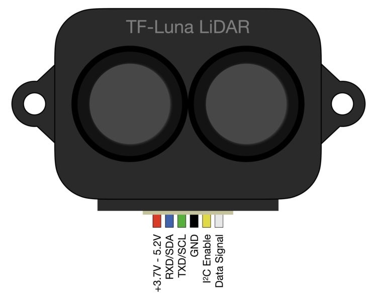

# Hardware and software setup
The hardware connections and software setup are available for the following sensors:
- [HC-SR05](#hc-sr05)
- [DFRobot URM09](#dfrobot-urm09)
- [VL53L4CX](#vl53l4cx)
- [VL53L5CX](#vl53l5cx)
- [DFRobot SEN0413](#dfrobot-sen0413)
- [TFLUNA](#tfluna)
- [RPLIDAR](#rplidar)
- [OAK-D Lite](#oak-d-lite)

Methods for [checking](#check-for-i2c-on-your-board) and [activating](#activate-i2c-on-your-board) I2C on your board.

Methods for [checking](#check-for-uart-on-your-board) and [activating](#activate-UART-on-your-board) UART on your board.

Links to [additional resources](#other-resources) available at the bottom of this document.

## Raspberry Pi 4 pinout

## HC-SR05
#### Pin connections:
- Trigger pin -> GPIO23
- Echo pin -> GPIO24 (through a resistor divider to accomodate de 3V3 level of the RaspberryPi)

#### Python virtual environment setup:
~~~~bash
python3.9 -m venv venvHCSR05
pip install -U pip
pip install wheel
pip install RPi.GPIO
~~~~

#### Common errors:
- make sure your user is in the `gpio` group
- install the dev package of your python version (for example `python3.9-dev`)
- you may need to install `rpi.gpio-common` in Ubuntu

## DFRobot URM09
This sensor uses I2C, [check](#check-for-i2c-on-your-board) and [activate](#activate-i2c-on-your-board) it!

#### Pin connections:
- Data pin -> GPIO2
- Clock pin -> GPIO3

#### Python virtual environment setup:
~~~~bash
python3.9 -m venv venvURM09
pip install -U pip
pip install wheel
pip install serial smbus
~~~~

## VL53L4CX
This sensor uses I2C, [check](#check-for-i2c-on-your-board) and [activate](#activate-i2c-on-your-board) it!

Default address: __0x29__

#### Pin connections:
- Data pin -> GPIO2
- Clock pin -> GPIO3
- [2.8V - 5.5V] on VIN pin (for 3V3 usage bypass regulator by connecting to VDD and __LEAVE VIN DISCONNECTED__!!)

#### Python virtual environment setup:
~~~~bash
python3.9 -m venv venvVL53L4CX
pip install -U pip
pip install wheel
pip install smbus2 RPi.GPIO adafruit-circuitpython-vl53l4cd
~~~~

## VL53L5CX
This sensor uses I2C, [check](#check-for-i2c-on-your-board) and [activate](#activate-i2c-on-your-board) it!

Default address: __0x29__

#### Pin connections:
- Data pin -> GPIO2
- Clock pin -> GPIO3
- [2.8V - 5.5V] on VIN pin (for 3V3 usage bypass regulator by connecting to VDD and __LEAVE VIN DISCONNECTED__!!)

#### Python virtual environment setup:
~~~~bash
python3.9 -m venv venvVL53L5CX
pip install -U pip
pip install wheel
pip install smbus2 VL53L5CX
~~~~

## DFRobot SEN0413
WIP

## TFLUNA

#### Pin connections:
##### I2C:
This sensor uses I2C, [check](#check-for-i2c-on-your-board) and [activate](#activate-i2c-on-your-board) it!

Default address: __0x10__
- I2C Enable -> GROUND
- Data pin -> GPIO2
- Clock pin -> GPIO3
- [3.7V - 5.2V] on VIN pin

##### UART:
This sensor uses UART, [check](#check-for-uart-on-your-board) and [activate](#activate-uart-on-your-board) it!
- I2C Enable -> FLOATING (or 3V3)
- RXD pin -> GPIO14
- TXD pin -> GPIO15
- [3.7V - 5.2V] on VIN pin

#### Python virtual environment setup:
~~~~bash
python3.9 -m venv venvTFLUNA
pip install -U pip
pip install wheel
pip install smbus2 tfli2c
# pip install serial tfluna-driver
~~~~

## RPLIDAR
WIP

## OAK-D Lite
WIP

# Check for I2C on your board
Check if it is already activated with:
~~~bash
ls /dev/i2c*
~~~
If the response is `/dev/i2c-1` I2C is activated else [try activating it](#activate-i2c-on-your-board).

You can detect I2C devices connected to your board using:
~~~~bash
i2cdetect -y 1
~~~~
If `i2cdetect` is not found, intall it with `sudo apt-get install i2c-tools`
If you don't have enough permissions, create a i2c and add your user to it:
~~~~bash
sudo groupadd --system i2c
sudo usermod <user-name> -aG i2c
echo 'KERNEL=="i2c-[0-9]*", GROUP="i2c"' >> /etc/udev/rules.d/10-local_i2c_group.rules
~~~~

> For DEBUGGING purposes ONLY: give I2C permissions to everyone (only for current boot) ``sudo chmod a+rw /dev/i2c-*``

# Activate I2C on your board
## For RaspiOS
Use the `raspi-config` command ([see this tutorial from pi3g](https://pi3g.com/2021/05/20/enabling-and-checking-i2c-on-the-raspberry-pi-using-the-command-line-for-your-own-scripts/) to set it with a single command line)

## For Ubuntu
Make sure `dtparam=i2c_arm=on` is set in the `/boot/firmware/config.txt` file
(Optionally also check `i2c-dev` is in the `/etc/modules` file)

# Check for UART on your board
Check if it is already activated with:
~~~bash
ls -l /dev/serial*
~~~
If the response is `/dev/serial0 -> ttyS0` I2C is activated else [try activating it](#activate-uart-on-your-board).

# Activate UART on your board
WIP
<!-- ## For RaspiOS

## For Ubuntu

[see this tutorial from MakersPortal](https://makersportal.com/blog/distance-detection-with-the-tf-luna-lidar-and-raspberry-pi -->

# Other Resources
- [ThePiHut tutorial for HC-SR04 and HC-SR05](https://thepihut.com/blogs/raspberry-pi-tutorials/hc-sr04-ultrasonic-range-sensor-on-the-raspberry-pi)
- [GPIO setup on Ubuntu before 21.04](https://forums.raspberrypi.com/viewtopic.php?t=289084#p1748054)
- [GPIO setup on Ubuntu after 21.04](https://ubuntu.com/tutorials/gpio-on-raspberry-pi#1-overview)
- [Enable I2C on RaspiOS](https://pi3g.com/2021/05/20/enabling-and-checking-i2c-on-the-raspberry-pi-using-the-command-line-for-your-own-scripts/)
- [I2C permissions](https://lexruee.ch/setting-i2c-permissions-for-non-root-users.html)
